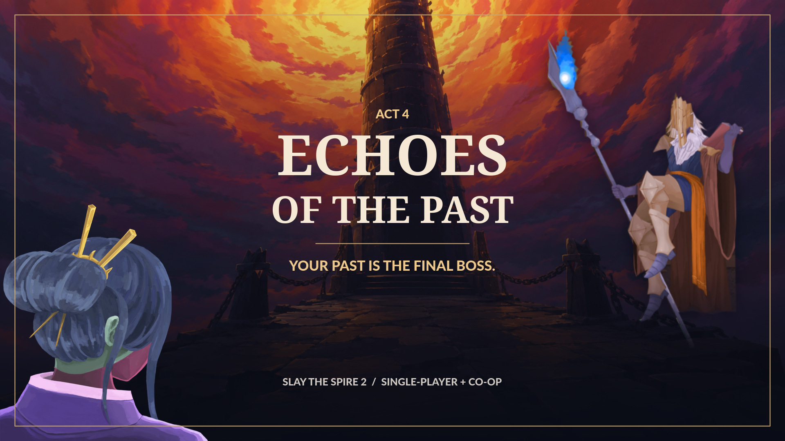

# Act 4: Echos of the Past



**A new fourth act for Slay the Spire 2. Your past is the final boss.**

Previously named **The Architect**. The internal mod ID and save paths remain
`TheArchitect`; the boss and in-game act still retain that name.

Meet **The Watcher**, choose an Ancient gift, and confront the Architect.
On later visits, first fight a **Corrupted Player** wielding your previous deck.
Play solo or bring a 2-4 player party: the same host and group face their entire
last saved party before the Architect enters the same combat.

**1.0.1 release preparation:** an update to the existing
[Steam Workshop listing](https://steamcommunity.com/sharedfiles/filedetails/?id=3799307965)
and a matching GitHub download. The Steam-edited description is preserved.
Nothing is published by the release scripts. See the [release notes](release/RELEASE_NOTES.md),
[installation guide](release/INSTALL.md), [screenshots](docs/media/README.md), and
[publishing checklist](docs/RELEASING.md).

To play, use **public-beta v0.111.0** and **BaseLib 3.4.5**, enable both mods,
and start a new modded run. Disable other fourth-act mods. Everyone in co-op
needs matching versions. Download the packaged release ZIP, not the source
archive; players do not need the developer tools listed below.

The project was scaffolded from the [Slay the Spire 2 Content mod template](https://github.com/Alchyr/ModTemplate-StS2)
and depends on BaseLib.

For maintenance, see the [game entrypoint and upgrade-risk inventory](docs/GAME_ENTRYPOINTS.md),
which separates BaseLib APIs, native callbacks, custom patches, and private/scene dependencies.

## Gameplay and compatibility

Version 1.0.1 targets Steam's **public-beta**, game **v0.111.0**
(Steam build `24724944`, game commit `41cef1ea`), with **BaseLib 3.4.5**.
It supports single-player and multiplayer runs. All participants must use matching
game, mod and content versions. Disable other fourth-act mods, including Act4Heart,
before playing.

After Act 3, the run continues directly to **Act 4 — The Architect** with a fixed
Ancient → Rest Site → Shop → boss route. The first visit fights the Architect; later
visits first fight a corrupted version of the previous completed character.
In multiplayer, repeat visits fight the **entire last saved party** for the same
host and group membership. All Corrupted Players enter together, and the Architect
appears only after every member is defeated, without restarting combat.
Each multiplayer enemy is named **Corrupted &lt;Player Name&gt;** and directs
explicitly targeted cards at its matching human, falling back to another living
player if that counterpart cannot be hit. AOE attacks still hit the whole party,
and random-target cards and orbs retain native randomness.
The Corrupted Player starts at twice that character's saved maximum HP, or
2.5 times at Ascension 8 (Tough Enemies) and above in the current run (rounded up).
These values do not receive an additional multiplayer HP multiplier: the extra
Corrupted Players provide the party-size scaling. The Architect's HP and shared
per-turn damage cap use the native final-act boss multiplayer scaling tier
(base value times player count times 1.3). Solo damage caps remain 300, or 200
at Ascension 8 and above.
The compact map fits all four nodes without scrolling, using neutral-ink
icons and an original Architect boss silhouette. Rest and Shop share the
supplied tower-approach illustration; the boss fight retains the
native Architect workshop interior. Native campfire, merchant, and room
interactions remain intact.

**The Watcher**, keeper of forgotten lessons, offers one mandatory choice from
three personal relic offers: **Preparation**, **Discipline**, and **Transcendence**.
Each category contains four candidates. Native Ancient entry healing, choices, reward screens,
and save behavior are retained; there is no decline or reroll. Ancient choices
use the native multiplayer synchronization. Candidates have equal weights within each category.

| Category | Relic | Effect |
| --- | --- | --- |
| Preparation | The Last Wish | Gain 99 Gold. Start combat with 4 Plating and 1 Strength. |
| Preparation | Golden Eye | Scry 8 at the start of combat. |
| Preparation | Orange Pearl | Start combat with 1 Artifact. |
| Preparation | Medieval Meal | Gain 20 maximum HP and receive two potion rewards and one rare-card reward. |
| Discipline | Loose Thread | Draw +1 on your first three turns. |
| Discipline | Diamond Hand | After the opening draw, apply combat-only Glam to a random eligible unenchanted card in hand. |
| Discipline | Deus Ex Machina | Upon pickup, enchant 3 random eligible deck cards with Sown. |
| Discipline | Violet Lotus | Upon pickup, enchant 2 random deck cards with Wrath and 2 other cards with Calm. |
| Transcendence | Nuremberg Egg | The 12th card played each combat is replayed twice, then the original Exhausts. Once per combat. |
| Transcendence | Ritual Dagger | Start combat with 1 Ritual and 3 Vulnerable. |
| Transcendence | Deva Form | After the first mid-combat reshuffle, gain 1 additional Energy at the start of each subsequent turn. Does not stack. |
| Transcendence | Handheld Mirror | Acquire a copy of 3 random relics. |

Scry lets you inspect the top cards of your draw pile and discard any of them.
Playing a Wrath-enchanted card enters Wrath: your Attacks deal 50% more damage,
and enemy damage against you is increased by 50%. Playing a Calm-enchanted
card enters Calm; leaving Calm grants 1 Energy. Entering the same stance again
does not count as leaving it. Stances last until changed and reset after combat.
Deus Ex Machina and Violet Lotus are offered only when at least three or four
eligible unenchanted cards remain, respectively. If another pickup effect changes
the deck before a copied relic resolves, it enchants the remaining eligible cards
without replacing existing enchantments and logs the shortfall.

The retired **Unspent Possibility**, **Crooked Needle**, and **Borrowed Tomorrow**
are excluded only from new Ancient offers. Their model IDs, effects, localization,
and artwork remain available to existing saves and run history. Medieval Meal
retains the original `LAST_MEAL` identity; The Watcher retains the original
`THE_UNWRITTEN` event identity. No saved relic is replaced or removed.

First and Repeat Visits use the same pool. Turn counts include extra turns, and
the Corrupted Player-to-Architect transition does not restart bonuses or copied
relic counters. Only permanent deck and maximum-HP changes enter the existing
terminal snapshot; relics, Gold, potions, and combat-only Glam do not.
The Watcher uses the supplied full-scene Ancient artwork and a matching map icon.
Seven new relic icons were illustrated in parallel, isolated GPT-6 Astra contexts,
alongside the retained icons, with matching inventory, selection-outline, and
large inspection textures. Editable SVG sources accompany the relic PNG assets.
Wrath and Calm have distinct original 64x64 enchantment icons with transparent
padding and dark outlines, displayed in the native 35x35 card marker. Their
editable sources are `TheArchitect/images/enchantments/{wrath,calm}.svg`; regenerate
each PNG with `magick -background none -density 768 <source.svg> -resize 64x64 -strip PNG32:<output.png>`.
Matching 256x256 inspection textures live in `images/enchantments/big`; rasterize the
same sources at density 1536 and resize to 256x256 for those variants.
The private `scripts/native-demo.sh run "/path/to/Slay the Spire 2" --enchantment-art --resolution 1920x1080`
scenario verifies packed textures and restored-deck/hand card markers beside native enchantments.
Mirror can copy owned relic types, including modded relics, by default.
Its blocklist excludes Mirror itself, Touch of Orobas, Pael's Eye, Golden Compass,
Fur Coat, Lord's Parasol, Archaic Tooth, Paper Krane, Paper Phrog, Lava Rock,
Winged Boots, and Byrdpip; melted copies are also excluded. At least three
distinct eligible types are required for Mirror to be offered. The shared
blocklist in `TheArchitectCode/Relics/MirrorDuplication.cs` applies to both offers
and duplication. Copied relics keep their normal acquisition behavior,
requirements, and drawbacks. Dusty Tome retains its prepared card, Sea Glass
retains its selected character, and Girya retains its current training (including
all three lifts when fully trained). Other counters still start fresh. When
several copies of a type are owned, the first non-melted copy in inventory supplies
this state. All three copies are prepared before any pickup effect runs.
Older saves already in the Architect Act retain their original three-stop route.
Interrupted nested rewards inherit native Ancient limitations, not a new
crash-safe transaction system.

The Corrupted Player now uses the **native in-process card engine in normal play**,
restoring the saved deck, upgrades, native enchantments and saved card properties.
It owns persistent native energy, piles, powers, RNG, orbs and pets without
joining the human party. There is no worker process or adapter fallback.
Cards play left to right with deterministic first-valid choices. The Corrupted Player
draws its upcoming hand during your turn (five cards by default), then plays
that hand when you end your turn without drawing a second opening hand. The preview
shows its actual hand and resources, not a guaranteed damage forecast;
cards enlarge on hover. Native orb slots appear for Defect and for any other
character that acquires orb capacity. Enemy pets stay beside their Corrupted Player,
without moving the human.
Corrupted Parties place the host nearest the human party, independently of saved
lineage order. With three players, the third stands above and between the first
two, mirroring the human party's triangular formation.
Four-player parties use two wider rows, with the back pair shifted diagonally
away from the humans to keep the bodies and card rows distinct.

Corrupted Players use **Bound Echo** rather than a purple tint: cyan-violet
afterimages and a slowly shifting body slice sit inside orbiting gold seals and
a ground sigil. The effect composites the animated body, not individual Spine
attachments, and leaves native character materials, health, intents and orbs
alone. Enemy-owned Osty gets the same effect on its own body, including when it
grows or revives; the human's Osty is unchanged. The bindings stay outside the
distortion and fade when their creature dies.

Native co-op cards support the Corrupted Party: ally targets, shared resources,
generated cards and card transfers stay on that side, never the human party.
Cards requiring another player remain unplayed when no living corrupted ally
exists; pets do not count as player targets. Human relics do not supply the
Corrupted Players' block, repeat or power bonuses.
Installed modded cards, enchantments and BaseLib card modifiers execute their own
effects through the same engine, including restored BaseLib saved values.
Mod mechanics that assume human-only UI, relics or other uncaptured character
state may still need specific compatibility work. Unrecognized saved extension
formats remain visibly **Unsupported**; the original saved JSON is preserved.
Missing saved models block entry with an actionable error rather than silently
dropping cards. This is not a claim that every vanilla card combination has been
audited. See [native Corrupted Player behavior and boundaries](TheArchitectCode/CorruptedPlayerCombat/README.md).

**Optional Downfall support:** when Downfall **0.1.16** is already loaded, an
actor-scoped adapter initializes ghostwheels, spellbooks, and Slime Boss slots,
includes ghostflame/stance combat hooks, and advances corrupted ghostwheels on
their own turns. Ghostflame targeting/choices and slime creation retain enemy
ownership and private RNG. The adapter neither enrolls enemies in the human party
nor grants starter relics. Downfall is not required, bundled, or referenced by the
build. Unverified Downfall versions/API layouts are logged and their corrupted
cards/effects are explicitly marked **Unsupported**, rather than guessing at
changed internals. This is not blanket coverage of every Downfall card or UI.

The vanilla post-Act 3 dialogue and attack sequence now plays after **either**
Architect outcome. After the Architect's final attack, the whole party is bound
and gradually takes on the Bound Echo corruption effect instead of playing the
usual ending death animation, then the native victory screen opens. Defeated
party members appear in the sequence without being revived; the actual combat
outcome, terminal HP, and saved successor builds remain unchanged.

For fast feedback, start a disposable modded single-player run, open the
developer console with the **backtick (`)** key, and enter `architect`. This skips to the Act 4
map using your current build; The Watcher's native entry healing still applies,
but the command does not grant a late-game deck or extra Gold.
Normal completion of this run can replace your profile's Corrupted Player.
Use `architect`, not `act 4`: the vanilla `act` command can only visit acts
already appended to the current run.

The isolated native arrival scenario needs no snapshot input:
`bash scripts/native-demo.sh run "/path/to/Slay the Spire 2" --ancient`.
It uses disposable saves and the worktree's `artifacts/mods`, never the live mod
installation. The `architect` command includes The Watcher; the direct
boss bootstrap below intentionally remains a combat-only entry.

The repository skill [`setup-act4`](.github/skills/setup-act4/SKILL.md) coordinates
this setup from random victory histories: source Slot 1 to modded Slot 2 by
default, with backups and naturally rolled Ancient offers. Explicit slot
overrides are supported.

`--architect-history-setup /absolute/path/to/config.json` prepares a live selected-slot
run from two single-player victory histories and opens The Watcher with Mirror
offered by the selected native seed unless disabled below. Select the target and
back it up first; the launcher refuses a mismatched slot or an active run.
The configuration supplies `ProfileId` (1, 2 or 3),
`PlayerHistoryPath`, `OpponentHistoryPath`, `OutputDirectory`, a `Seed` prefix,
and explicit historical `MaxEnergy` / `BaseOrbSlotCount` values, which run history
does not store. Deck upgrades, enchantments, relic state, potions, HP and Gold are
restored without replaying acquisition rewards. Ordinary launches do not run
this setup.
Set `ForceMirror` to `false` to use `Seed` unchanged and let all Ancient offers
roll normally; it defaults to `true` for existing Mirror-specific setups.
`--architect-resume-slot2` instead opens the existing selected Slot 2 single-player
save without rerunning history setup or replacing its rewards and Shop choices.

An alternative **unsaved** developer launch uses the game's bootstrap mode:
`--bootstrap --architect-playtest`. Add `--architect-repeat` to use a copy of
the test character's deck for the Corrupted Player phase. This does not replace the
profile's Corrupted Player or record run history.

Developer checks: `dotnet run --project tests/CorruptedPlayer/CorruptedPlayer.Tests.csproj`
and `dotnet run --project tests/Architect/Architect.Tests.csproj` retain the
legacy planner and persistence/Architect regressions. They are not substitutes
for native runtime coverage. The Linux `scripts/native-demo.sh` launcher exercises
the production actor from normal startup using a disposable copy of a supplied
snapshot; its name is historical. See its documented invocation and isolation
requirements in the native Corrupted Player README. On Linux, `native-demo.sh run`
uses a private virtual display per instance, so worktrees can run and capture
concurrently without sharing desktop input. Installed game assets are shared
read-only; only each run's small mod bundle, disposable snapshot and optional
shader caches are copied.
For faster in-process automation, opt into `run --shared-visible`: separate
GPU-rendered desktop windows retain file/process isolation, use native viewport
captures, and reject external mouse/keyboard commands. Desktop focus is still
shared; see the native Corrupted Player README for the tradeoff and measured timings.
**Changing XDG_DATA_HOME alone
does not isolate Steam Cloud or real saves.**

Downfall integration probes use the installed mod's real models rather than synthetic
cards. Build to a separate bundle with
`scripts/build.sh --mods-path artifacts/downfall-mods`, then copy the installed
`BaseLib` and `Downfall` DLL/JSON/PCK files into matching subdirectories of that
bundle. Set `ARCHITECT_MODS_INPUT` to its absolute path and run, for example,
`bash scripts/native-demo.sh run "/path/to/Slay the Spire 2" --downfall-champ`.
The independent scenarios are `--downfall-snecko`, `--downfall-slimeboss`,
`--downfall-hermit`, `--downfall-hexaghost`, `--downfall-guardian`,
`--downfall-champ`, `--downfall-awakened`, and `--downfall-automaton`.
They need no saved snapshot, do not install anything into the live game, and fail
explicitly if a requested character or required mod is unavailable.
Each scenario checks its registered card catalog's snapshot round trips, three
ordinary Corrupted Player starter-deck turns without relics, human RNG isolation,
and controlled normal/upgraded attack and Block effects, ownership, and energy.
Snecko additionally covers the Overflow hand-size boundary; Slime Boss covers
Goop application, bonus damage, consumption, owned slime pets and their automatic
commands. Champ covers stance listeners and its Defensive finisher. Hexaghost
covers initialized Float, forced/natural ignition, opposing targets, and enemy-turn
advancement including Inferno wraparound, instead of treating its flame-augmented
attacks as plain Strikes. Every character checks private resource initialization
and preservation of the human's custom state. Runs use disposable Instant
animation preferences and a longer turn deadline for software rendering.
Catalog serialization is **not** evidence that every card's effect works.
Run receipts record the exact mod-file hashes; logs and captures remain under
`artifacts/native-demo/<run-id>/`.

For a visible, interactive four-enemy Downfall showcase, use
`--downfall-party --manual --shared-visible` with that same mod bundle.
Hexaghost, Awakened, Slime Boss, and Champ each have a five-card deck featuring
ghostflames/Soulburn, Conjure/Chant, Goop/Consume/Tackle/slimes, or stances/Finishers,
respectively. The disposable fight opens on the human turn without automated plays.

The ending scenario needs no snapshot input:
`bash scripts/native-demo.sh run "/path/to/Slay the Spire 2" --ending`.
It covers the direct Act 3 handoff, both outcomes, and full-party binding using
all five base characters. Its simulated multiplayer party is not a live network test.

To reproduce an existing Corrupted Player fight without touching its profile,
set `ARCHITECT_RUN_INPUT` to the saved `current_run.save` and run
`scripts/native-demo.sh run "/path/to/Slay the Spire 2" --saved-run`.
This copies the run into the isolated instance and exercises preview creation,
human power-card play, and save/reload, including optimized creature-identity reads.

For the Bound Echo visual pass, build to `artifacts/mods`, close the game, then
run `bash scripts/native-demo.sh --exclusive-window "/path/to/Slay the Spire 2" --corruption`.
This opt-in scenario uses the five base characters rather than a saved snapshot,
with disposable data and Steam disabled. Its captures and log go under
`artifacts/native-demo/`; it does not install the build into the live game.

Corrupted Players are stored locally in the active **modded** profile's
`TheArchitect/corrupted_player_snapshot.json`, with an atomic replacement and backup.
They are not synchronized through Steam Cloud. Keep the same character/content
mods enabled for the next visit; in single-player, an unavailable character produces a First Visit.

Multiplayer lineages are separate, host-owned files under
`TheArchitect/multiplayer/<host-profile-uuid>/<group-key>.json`. A group is an
order-independent set of persistent profile identities; changing a participant
or host starts a separate lineage. Both Architect wins and losses replace the
complete saved party atomically, including participants who died. Clients never
replace their own single-player snapshots with the host's party.
Act 4 waits for every original participant to validate the host's frozen party,
and saves/rejoins retain that same selection. Missing content or failed
synchronization blocks entry with an error rather than loading a partial party.
Host migration is not supported.

On the single-player and multiplayer character-select screens, **View Corrupted
Deck** (or **View Corrupted Decks**) appears beneath the confirm checkmark.
Browse the saved deck, including upgrades and enchantments, and click a card to
inspect it. Multiplayer previews use the host's lineage for the current complete
group, with one deck tab per Corrupted Player; joining or leaving refreshes the
preview for everyone. First Visits and unavailable previews are explained rather
than showing a different opponent. Browsing does not change saved decks or ready
the player.

The isolated menu scenario is
`bash scripts/native-demo.sh run "/path/to/Slay the Spire 2" --deck-preview`.
It creates only disposable snapshots and covers both menu modes, First Visit,
saved upgrades, card inspection, and party deck selection.
Set `ARCHITECT_SNAPSHOT_INPUT` to an existing Corrupted Player snapshot to capture
its single-player deck instead of the sample deck; the source file is only copied.

The 1.0.0 scope does not include every item in #2. Full
crash-transaction recovery between snapshot capture and base-game progression/history
is still tracked in #12. Avoid force-closing the game during the result transition.
The beta game's normal combat saves restart the encounter rather than resuming mid-turn.

**Naming:** The enemy fought before the Architect is the **Corrupted Player**,
not the human player. Code identifiers, paths, and save keys use this name too.
Pre-release saves using the old name are not migrated.

## Developer requirements

- .NET SDK 9.0 or newer (the mod targets `net9.0`)
- Slay the Spire 2 installed through Steam (or a copy of `sts2.dll` and `0Harmony.dll`)
- Docker, if you prefer building in the provided container instead of installing the SDK locally
- MegaDot / Godot 4.5.1 mono — only needed for a full Godot export when publishing
  (the game will not load a `.pck` exported with a newer Godot version)

## Setup

1. Clone the repository.
2. Copy `Directory.Build.props.example` to `Directory.Build.props` and edit it:
   - set `GodotPath` to your MegaDot/Godot mono executable;
   - uncomment and set `Sts2Path` if the game is not found automatically.

   `Directory.Build.props` is machine specific and is intentionally git-ignored.
3. Open `TheArchitect.sln` in your IDE, or build from the command line.

The game install is discovered automatically by `Sts2PathDiscovery.props` for the default Steam
locations on Windows, Linux and macOS. `sts2.dll` and `0Harmony.dll` are referenced directly from
that install, so the game must be installed before building.

## Building

Single command, on Linux/macOS and Windows respectively:

```
scripts/build.sh
```

```powershell
./scripts/build.ps1
```

This copies `TheArchitect.dll`, `TheArchitect.pdb`, `TheArchitect.json`, and an automatically
packed `TheArchitect.pck` into the game's `mods/TheArchitect/` folder.
Install the matching BaseLib runtime (`BaseLib.dll`, `BaseLib.json`, `BaseLib.pck`)
in `mods/BaseLib/` as well. Restart the game after rebuilding.
Add `--publish` (`-Publish` in PowerShell) to run a full Godot
export of the assets in `TheArchitect/`; that requires a Godot/MegaDot 4.5.1 mono executable,
taken from `GodotPath` in `Directory.Build.props` or from `--godot`.

Both scripts accept the same options — run them with `--help` / `Get-Help` for the full list:

| Option | Environment variable | Purpose |
| --- | --- | --- |
| `--configuration` | `CONFIGURATION` | Build configuration, defaults to `Debug` |
| `--sts2-path` | `STS2_PATH` | Game install directory, when auto-detection fails |
| `--sts2-data-dir` | `STS2_DATA_DIR` | Directory holding `sts2.dll` and `0Harmony.dll` |
| `--mods-path` | `MODS_PATH` | Where the built mod is copied, defaults to the game's `mods` folder |
| `--godot` | `GODOT_BIN` | Godot/MegaDot 4.5.1 mono executable |
| `--publish` | — | Also export the `.pck` |

Plain `dotnet build` / `dotnet publish` still work if you prefer, and also default
to copying into the live game. For development, use
`scripts/build.sh --mods-path artifacts/mods`; install only with the game closed.

### Building in Docker

`Dockerfile` describes a build environment with the .NET SDK, Godot 4.5.1 mono and the native
libraries Godot needs. It deliberately does not contain the game assemblies; the game install is
mounted read-only at build time:

```
scripts/docker-build.sh
```

The helper builds the image, mounts the repository and the game (override the location with
`STS2_PATH`), and writes the built mod to `artifacts/mods` (override with `OUTPUT_DIR`). Any extra
arguments are forwarded to `scripts/build.sh`, e.g. `scripts/docker-build.sh --configuration Release`.

## Continuous integration

`.github/workflows/build.yml` runs on every push and pull request. It validates the mod manifest
(`scripts/validate_manifest.py`), builds the mod, uploads the result as a workflow artifact, and
builds the Docker image so the build environment stays working.

Because `sts2.dll` and `0Harmony.dll` cannot be redistributed, the compilation step needs them to be
supplied: set the repository secret `STS2_ASSEMBLIES_URL` to a URL of a zip archive containing those
two assemblies (or API stubs exposing the same public surface). When the secret is absent the
workflow still validates the manifest and the Docker image, and logs a warning that compilation was
skipped.

## Layout

| Path | Purpose |
| --- | --- |
| `TheArchitect.json` | Mod manifest (id, version, dependencies, min game version) |
| `TheArchitect/` | Assets: images, localization, `mod_image.png` — packed into the `.pck` |
| `TheArchitectCode/` | C# source; `MainFile.cs` is the mod entry point and applies Harmony patches |
| `project.godot`, `export_presets.cfg` | Godot project used for exporting the asset `.pck` |
| `Sts2PathDiscovery.props` | Locates the Slay the Spire 2 install |
| `scripts/` | Build helpers and manifest validation |
| `Dockerfile` | Reproducible build environment |

See the [template wiki](https://github.com/Alchyr/ModTemplate-StS2/wiki) for further modding details.
