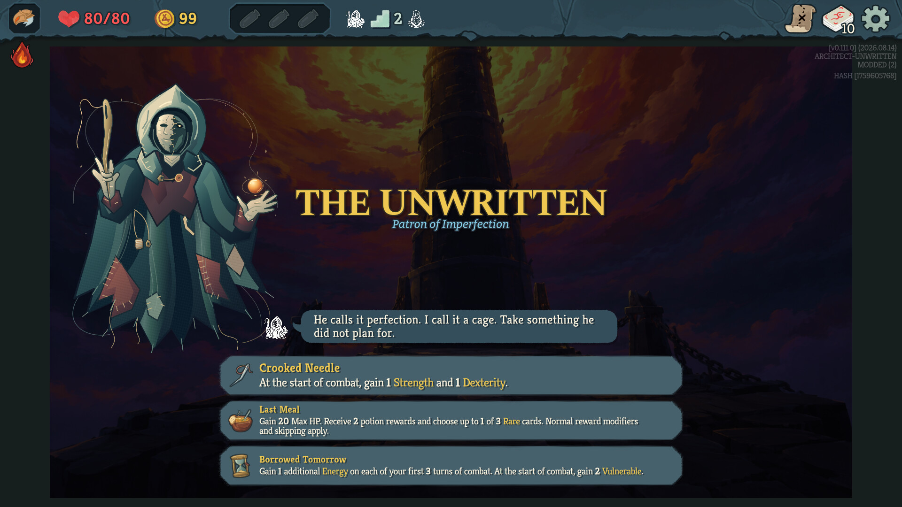
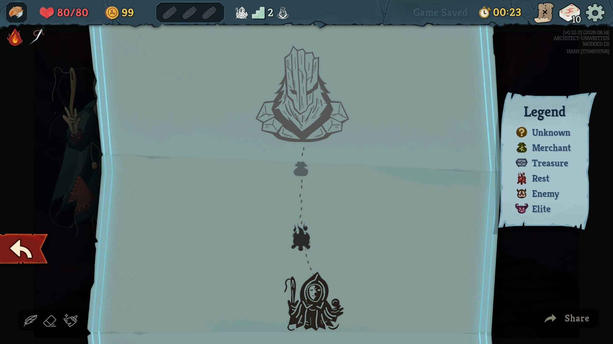
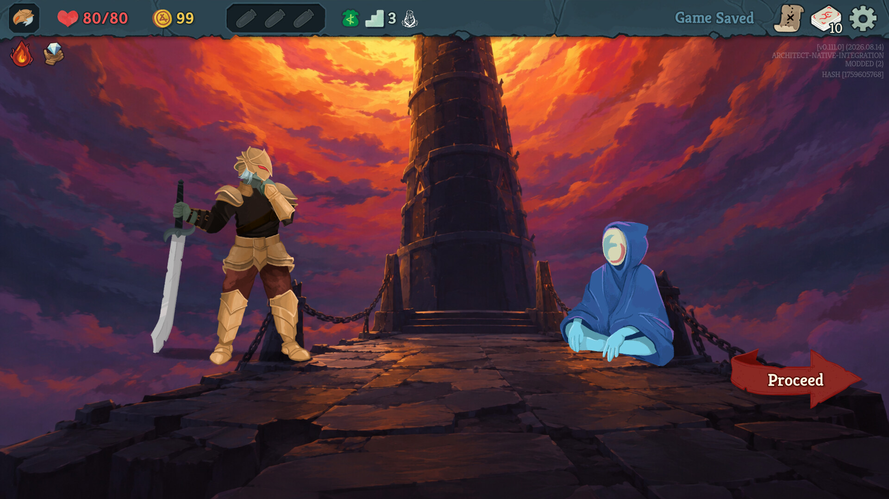

# Release media

Branding: **Act 4: Echoes of the Past** (1.0.1). The gameplay screenshots were
captured for 1.0.0; gameplay, the Ancient and the Architect encounter are unchanged.
The thumbnail, banner and in-game mod image have been updated to the new title.

## Promotional artwork

| File | Size | Purpose |
| --- | --- | --- |
| `workshop-thumbnail.png` | 1024 x 1024 | Steam Workshop's main `image.png`, below 1 MB |
| `release-banner.jpg` | 1920 x 1080 | README and release announcement |
| `../../TheArchitect/mod_image.png` | 420 x 420 | In-game mod browser image, replacing the placeholder |

The promotional artwork uses the repository's tower-approach illustration,
the Architect in the upper right, and a right-facing shoulder portrait in the
lower left. The text is centered, clear of both characters. Typography
uses Noto Serif Bold and Lato Heavy. The editable layout is
`scripts/build-release-media.sh`; no flattened text needs hand-editing.
Run it from anywhere with `bash scripts/build-release-media.sh`. Font file paths
can be overridden with `SERIF_FONT` and `SANS_FONT`.

Reusable character layers live in `source/`. `shoulder.png` is the supplied
transparent portrait, cropped during composition without mirroring.
`architect.png` is a masked, brightened cutout from the lossless native capture
used for `screenshots/05-the-architect-2.jpg`. It retains the encounter's purple
tint. The cutout is promotional artwork, not an unaltered gameplay screenshot;
the gallery images are not modified by the media build.

These are promotional compositions, not gameplay screenshots. Confirm the
underlying illustration's provenance before public distribution; see
[the publishing checklist](../RELEASING.md).

## Gameplay gallery

The screenshots are native game viewport captures from disposable, scripted
playthroughs, not mockups. The combat scenario restores a historical saved deck;
the player's build and route are prepared by the playtest launcher. They demonstrate
the actual rendering and UI, not an organically completed run or a live network
session. Only JPEG encoding is applied; the HUD and card effects are not retouched.









## Reproducing captures

Build to `artifacts/mods` first. Set `ARCHITECT_SNAPSHOT_INPUT` to an existing
Corrupted Player snapshot when capturing combat or a particular historical deck;
the input is copied read-only into disposable storage. Do not publish the input
save, profile identifiers, logs or run receipts.

```sh
bash scripts/native-demo.sh run "/path/to/Slay the Spire 2" \
  --shared-visible --resolution 1920x1080 --ancient --label release-ancient

ARCHITECT_SNAPSHOT_INPUT="/path/to/snapshot.json" \
bash scripts/native-demo.sh run "/path/to/Slay the Spire 2" \
  --shared-visible --resolution 1920x1080 --media --label release-combat

ARCHITECT_SNAPSHOT_INPUT="/path/to/snapshot.json" \
bash scripts/native-demo.sh run "/path/to/Slay the Spire 2" \
  --shared-visible --resolution 1920x1080 --deck-preview --label release-decks
```

Omit `--shared-visible` to use a private virtual display (requires Xvfb).
`--resolution` defaults to 1280x720 for existing playtests. Shared-visible mode
uses isolated files and native viewport capture, disables external input commands,
and may affect desktop focus while the window starts. It never replaces live
mods or saves. The game exits when its scenario finishes.

The launcher prints a worktree-local `artifacts/native-demo/run-*` directory.
`--media` follows the normal saved-deck encounter, adds time for room transitions
to settle before captures, and omits the separate synthetic card-mechanics probes.
It is a capture scenario, not a replacement for the default mechanics scenario.
Inspect its PNG captures and log before selecting images. Use `unwritten.png`,
`unwritten-map.png`, `unwritten-shop.png`, `corrupted-player-display.png`,
`architect.png`, and `deck-singleplayer.png` for the corresponding gallery entries.
Preserve image dimensions and encode JPEG previews below Steam's 1 MB limit:

```sh
magick <capture.png> -strip -sampling-factor 4:4:4 -quality 90 <screenshot.jpg>
```

Do not use failed-scenario captures to claim that the entire scenario passed.
The new artwork must be present in the captured build; rerun the Ancient/map
captures after changing either map icon or The Unwritten's presentation.
